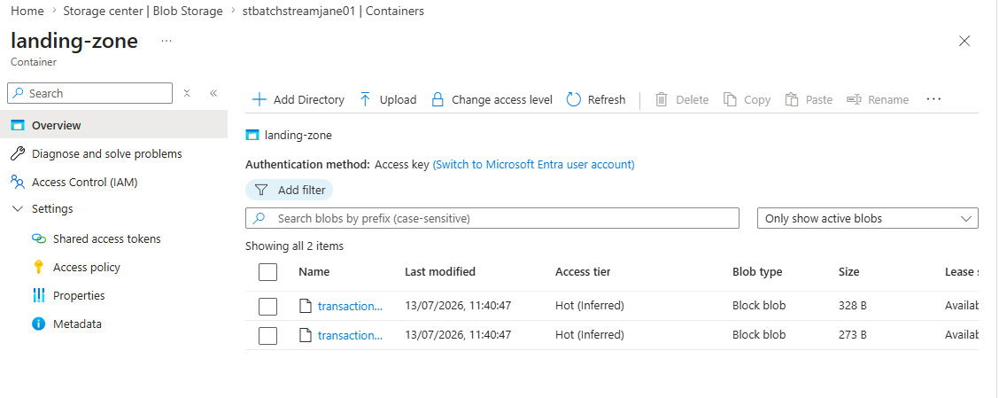
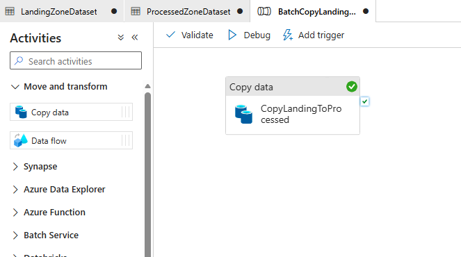
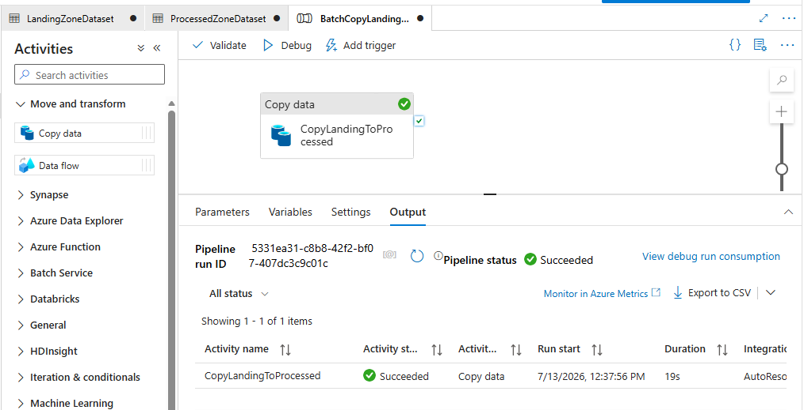
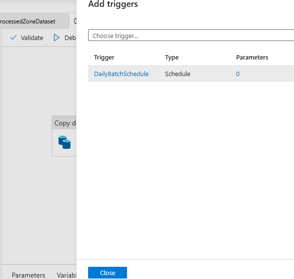
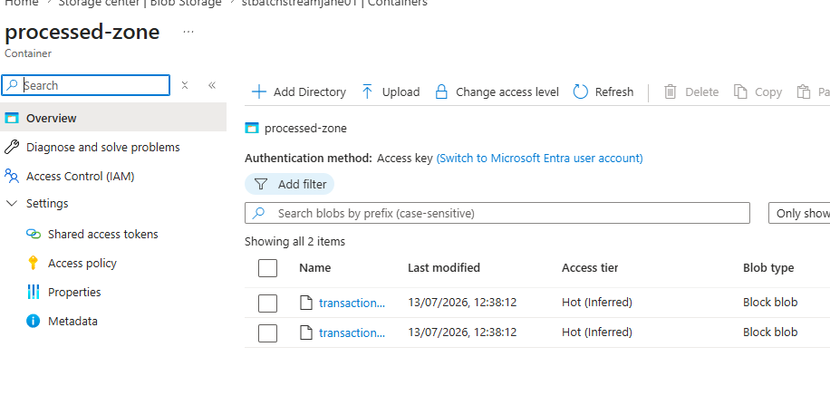
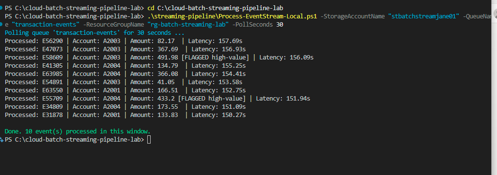

# Batch & Streaming Data Pipeline Lab

**A dual-pattern data processing pipeline - scheduled batch ETL via Azure Data
Factory, and event-driven near-real-time processing via Storage Queues and Azure
Functions - built entirely on a free Azure subscription.**

Most real-world data platforms run both patterns side by side: a nightly (or
hourly) batch job moving and transforming bulk data, and a separate event-driven
path reacting to individual events the moment they arrive. This lab implements
both, deliberately avoiding the tools that would normally anchor a "streaming"
project (Event Hubs, Stream Analytics, Databricks) - none of which have a genuine
free tier - in favour of an architecture that's both fully reproducible for free
and a legitimate real-world pattern in its own right, not just a workaround.

## Why Not Event Hubs / Stream Analytics / Databricks

This is worth stating directly rather than leaving implicit: these are the
"obvious" tools for a streaming project, and none of them work for this lab's
constraint.

- **Event Hubs**: no always-free tier - Basic SKU has a genuine minimum monthly
  charge from the moment a namespace exists, regardless of usage.
- **Stream Analytics**: billed per streaming unit-hour with no free allowance
- **Databricks**: offers a 14-day trial, not an always-free tier - unsuitable for
  a portfolio piece meant to be reproducible indefinitely.

Storage Queues + Azure Functions (Consumption plan) genuinely are always-free at
this lab's scale, and this combination is a real architecture pattern used by
teams below the volume threshold where Event Hubs' cost and operational overhead
becomes worth it - not a toy substitute.

## What's Included

| Component | Purpose |
|---|---|
| [`batch-pipeline/generate-batch-data.ps1`](batch-pipeline/generate-batch-data.ps1) | Generates sample batch data files for the landing zone. |
| [`batch-pipeline/adf-pipeline-definition.json`](batch-pipeline/adf-pipeline-definition.json) | Azure Data Factory pipeline definition - scheduled Copy Activity, landing zone to processed zone. |
| [`streaming-pipeline/simulate-event-stream.ps1`](streaming-pipeline/simulate-event-stream.ps1) | Simulates a live event stream by pushing messages to a Storage Queue .|
| [`streaming-pipeline/Process-EventStream-Local.ps1`](streaming-pipeline/Process-EventStream-Local.ps1) | Event consumer - processes each event within seconds of arrival, run locally after Azure Functions proved undeployable on this subscription (see docs/architecture.md). |
| [`streaming-pipeline/ProcessStreamEvent/`](streaming-pipeline/ProcessStreamEvent/) | The originally designed Azure Function (Queue trigger) - retained as directly deployable code, not usable on this specific Free Trial subscription. |
| [`docs/architecture.md`](docs/architecture.md) | Design rationale, cost model, and the batch-vs-streaming trade-off analysis. |
| [`docs/architecture-diagram.md`](docs/architecture-diagram.md) | Visual diagram of both pipelines and the Function-to-local-consumer substitution. |
| [`docs/setup-guide.md`](docs/setup-guide.md) | Full reproduction steps with screenshot evidence points. |
| [`docs/screenshots/`](docs/screenshots/) | Evidence of both pipelines actually deployed and running. |

## Batch vs. Streaming: The Core Distinction Demonstrated

| | Batch (Data Factory) | Streaming (Queue + Function) |
|---|---|---|
| **Trigger** | Schedule (e.g. daily) | Event arrival (each message) |
| **Latency** | Minutes to hours acceptable | Seconds |
| **Volume pattern** | Large batches, periodic | Continuous, individually small |
| **Typical real use** | Nightly reconciliation, end-of-day reporting, bulk data movement. | Transaction alerts, live dashboards, fraud-pattern triggers. |
| **Failure handling** | Re-run the whole pipeline | Per-message retry via queue visibility timeout. |

## Cost

- **Azure Data Factory**: Azure's always-free tier includes a monthly grant of
  low-frequency pipeline activity runs, which this lab's schedule comfortably sits
  within - see `docs/architecture.md` for the exact allowance and what happens
  beyond it.
- **Storage Queues**: negligible cost at any volume this lab generates - a few
  pence per 100,000 operations, and this lab's simulated stream is a handful of
  messages.
- **Azure Functions (Consumption plan)**: always-free grant of 1,000,000
  executions and 400,000 GB-seconds of compute per month - this lab's event volume
  is nowhere close to that threshold.

## Screenshots

Evidence of both pipelines, captured against a live Azure subscription during
this build. Files live in `docs/screenshots/`.

**1. Landing Zone Populated**

Sample batch data uploaded and ready for the Data Factory pipeline to pick up.

**2. Data Factory Pipeline Canvas**

The Copy Data activity configured with landing-zone as source and
processed-zone as sink.

**3. Pipeline Run Succeeded**

A debug run completing successfully - the batch copy working end to end.

**4. Schedule Trigger Configured**

The pipeline attached to a daily recurrence, turning a one-off run into a
repeatable scheduled job.

**5. Batch Output Verified**

Files landed correctly in processed-zone, confirming the batch pipeline moved
data end to end.

**6. Event Processing Latency**

The local event consumer processing simulated transaction events, with
per-event latency calculated and high-value transactions correctly flagged -
the core evidence for the streaming half of this project.

## Setup Guide

Full steps: [`docs/setup-guide.md`](docs/setup-guide.md).

## Skills Demonstrated

- **Batch ETL orchestration**: Azure Data Factory pipeline design, Copy Activity
  configuration, scheduled triggers.
- **Event-driven architecture**: Storage Queue-based messaging, Azure Functions
  Queue triggers, near-real-time processing without a dedicated streaming platform.
- **Architecture trade-off judgement**: choosing the right tool for data volume
  and latency requirements, rather than defaulting to the most feature-rich
  (and most expensive) option available.
- **Cost-aware platform selection**: recognising which Azure services have
  genuine always-free tiers versus time-boxed trials, and designing around that
  distinction deliberately.
- **PowerShell automation**: scripted data generation and event simulation for
  reproducible testing of both pipelines.

## Conclusion

This project set out to demonstrate two data processing patterns that
together cover most of what a real data platform actually runs day to day:
scheduled batch movement of bulk data, and event-driven processing of
individual events the moment they arrive. Both are working, verified end to
end against a live Azure subscription - a Data Factory pipeline copying real
files on a real schedule, and a queue-based consumer processing real events
with measured, logged latency.

What the build history in this repository also shows, deliberately left
visible rather than cleaned away, is what happens when the "textbook" tool
doesn't fit the constraint. The streaming component was originally designed
around Azure Functions - the standard, expected choice. On this specific
subscription, that choice was blocked twice over: once by a compute quota
policy, once by an explicit plan restriction. Diagnosing that correctly (not
just retrying blindly), confirming it via Microsoft's own documentation rather
than guessing, and substituting an architecturally equivalent solution that
preserves every property that actually matters - the queue's delivery
guarantees, the processing logic, the latency measurement - is, if anything,
a more accurate demonstration of real engineering work than a build that went
smoothly would have been. Production systems are built under real constraints
more often than not; recognising which constraints are fixable and which
require a genuine architectural pivot is a large part of the job.

The result is a repository that stands on its own: a working batch pipeline,
a working streaming pipeline, honest documentation of every design decision
and every real obstacle encountered, and a clear account of what would change
at enterprise scale. That combination - functioning systems plus the
reasoning behind them - is what this project is intended to show.

## Author

Jane - Cloud & Infrastructure Engineer, AZ-104 candidate.
Companion project to the Azure RBAC & Identity Baseline Governance Lab, Cloud Cost
Governance & Tag Compliance Automation, and On-Premise to Cloud Data Migration &
Storage Design Lab.
