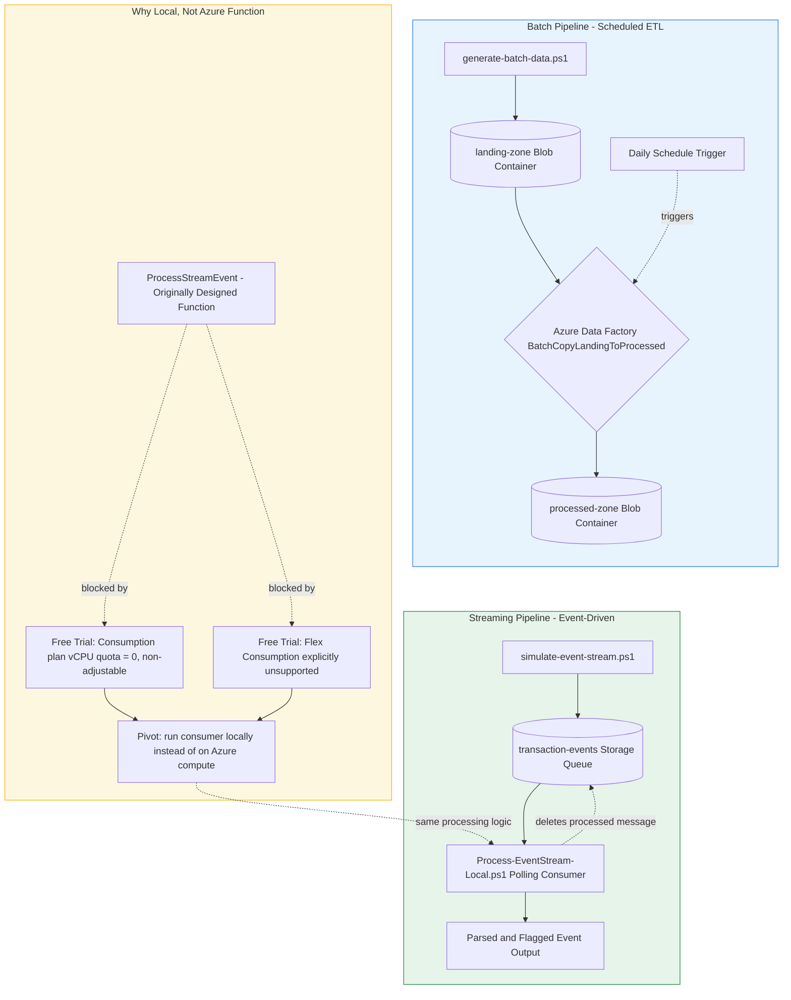

# Architecture Diagram

## Reading This Diagram

**Batch (top-left, blue):** a schedule trigger fires the Data Factory pipeline
daily, copying whatever files have landed in landing-zone into
processed-zone. Latency of minutes-to-hours is acceptable here - the whole
point is periodic, bulk movement, not immediacy.

**Streaming (top-right, green):** each event is sent individually to a Storage
Queue the moment it "happens" (simulated), and a polling consumer picks it up
and processes it within seconds - the defining characteristic that separates
this from the batch path is latency, not the specific tooling.

**Substitution (bottom, amber):** documents why the streaming consumer runs
locally rather than as a deployed Azure Function - a genuine, diagnosed
subscription restriction (Free Trial compute quota), not a design preference.
The original Function code is retained in the repo and would replace the
local consumer with no logic changes on a subscription without this
restriction.